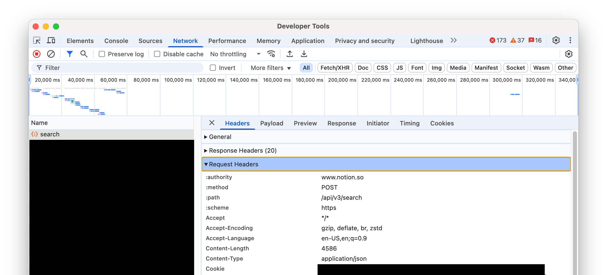
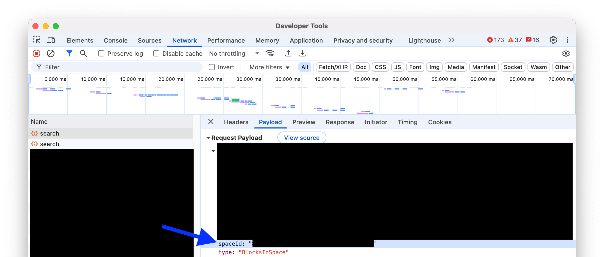

# Notion Search Alfred Workflow

<details>
<summary>A note on this fork</summary>

# A fork of [notion-search-alfred5-workflow](https://github.com/wrjlewis/notion-search-alfred5-workflow/)

The original project has these following problems:

- Including the `.pyc` files.
- Including the `__pycache__` folder.
- A separate (same) icon for the script filter — you don’t need it, it’ll use the workflow’s icon if it's empty.
- For the workflow icon, using one with a transparent background when the icon does not have a border — A non-transparent icon would look better, especially for dark Alfred themes.
- Including everything the user grabbed from the browser when sending requests -- Focus only on what’s necessary from a privacy standpoint — in this case, we only need the `notion_user_id` and `token_v2`.
- The try block containing too much. Instead, try to only include the code that might actually throw an error. If you're unsure how to handle a specific error, it’s better to leave it out. Remember, the workflow debugger is your friend here!
- Naming functions poorly. Instead of `buildnotionsearchquerydata`, `build_notion_search_query_data` is way better.
- No comment for core part of the code whatsoever.

So I created this fork.

</details>

An Alfred 5 workflow to search Notion with instant results

Simply type your keyword into Alfred (default: not) and provide a query to see instant search results from Notion that mimic the Quick Find function in the Notion webapp.

Pressing enter on a search result takes you to that page in Notion in your default web browser or notion app.

Hold Cmd + press enter on any search result to copy the url to your clipboard. 

**Additional features**

* The workflow also provides the ability to quickly see your __recently viewed pages__. Simply type the 'not' keyword to start the workflow, as you would before you search, and your most recently viewed notion pages are displayed.

* Open a new notion page by typing 'newnot', this only supports the web app currently, it's very handy!

## User Configuration

- `Cookie`: Needed for your Notion token.
- `Space ID`: Your organisation identifier.
- `Open in Desktop App`: Opens Notion links in the desktop app instead of the browser.
- `Search Pages Only`: Restricts search to only include pages, excluding content within pages.
- `Show Icons`: Displays icons for pages and other objects in search results.
- `Show Recent Pages`: Displays recently viewed pages when the search query is empty.
- `Icon Cache Length`: Defines the number of days for icons and images to be cached.

### Get your `cookie` headers

They should look something like this

```
notion_user_id=xxxxxxxxx-x; token_v2=xxxxxxxxxxxxxxx...
```



### Get your `spaceId`
It should look something like this

```
celcl9aa-c3l7-7504-ca19-0c985e34ll8d
```



### Add these values to the Notion Alfred workflow

Alfred should automatically open the 'configure workflow' options panel when you first install the workflow, here you can add the values obtained through the above steps.

You can also update these values at any time by clicking Configure Workflow.

